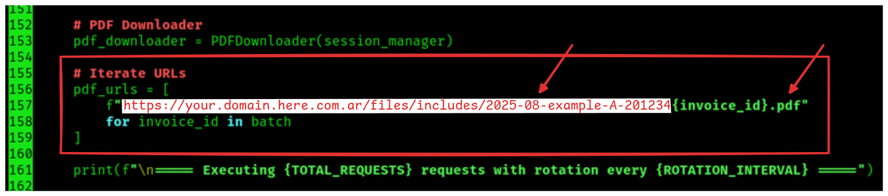
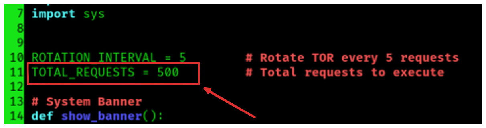

# 🤖 Tor Web Scraper 

System created in Python to do web scraping through the Tor network.
The tool is useful for scraping websites that contain the vulnerability of IDORs or URLs with sequential IDs.
The system allows you to automate the massive download of resources within the server such as: pdf, docs, xlsx, txt, csv, etc.

### **System Capabilities:**
* Fake user sessions (cookies + headers)
* User-agent rotation
* Smart timeout between requests
* Random ID generation
* Download files with status code 200 
* Automatic IP rotation with Tor
* Firewall Evasion

#### **Use:** 
```bash
python3 main.py <START_ID> <END_ID>
```
---
## 📄 Results

```text
The results are stored in the /downloads directory
```
---
## 🚀 Getting Started

### 1) Clone Github Repo
---

### 2) Create Virtual Env

```bash
virtualenv -p python3 .env
source .venv/bin/activate
```
---

### 2) Install requirements:

```bash
pip install -r requirements.txt
```
---

### 3) Set your Base-URL

Open the script "main.py" and place the Base-URL to be exploited.

---

### 4) Configure the total number of requests to execute

Open the script "main.py" and place a desired number of requests to execute.
By default TOTAL_REQUESTS = 500
This value can be modified according to your need.

---

### 5) TOR configuration

The scraping system uses the TOR (The Onion Router) network to anonymize HTTP requests and rotate IP addresses.
It is required to configure 3 key parameters

**Note:** You MUST previously have TOR installed, otherwise:
```bash
sudo apt install tor
systemctl start tor
```

#### Configure core/tor_controller.py file variables:
1. Default TOR SOCKS5 proxy address
```bash
TOR_SOCKS_PROXY = "socks5h://127.0.0.1:9050"
```
2. Standard value for TOR control port
```bash
TOR_CONTROL_PORT = 9051
```
3. Authentication password to access control port 9051:
```bash
TOR_PASSWORD = ""
```

#### Generate TOR Password:

**Step 1:** Generate the hash
```bash
tor --hash-password ScraperTor2025!
```
Example output:
```bash
16:8F3A5C1D4F2A9C8A9F0B...
```
**Step 2:** Configure the torrc file
Add to the /etc/tor/torrc file:
```bash
ControlPort 9051
HashedControlPassword 16:8F3A5C1D4F2A9C8A9F0B...
```
Restart TOR:
```bash
sudo systemctl restart tor
```
**Step 3:** Use the password in the script
The Python code uses the plain text password, NOT the hash:


---

## 📡 Social Network

**Linkedin:** [linkedin](https://www.linkedin.com/in/david-padron-9a74aa323/)
